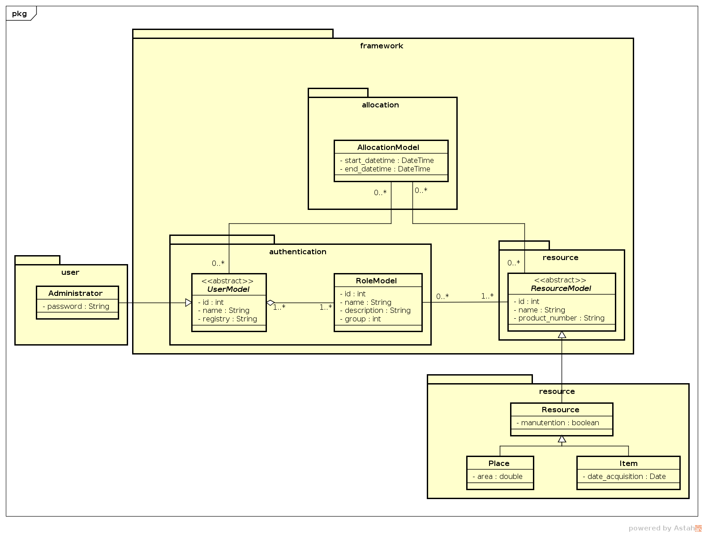
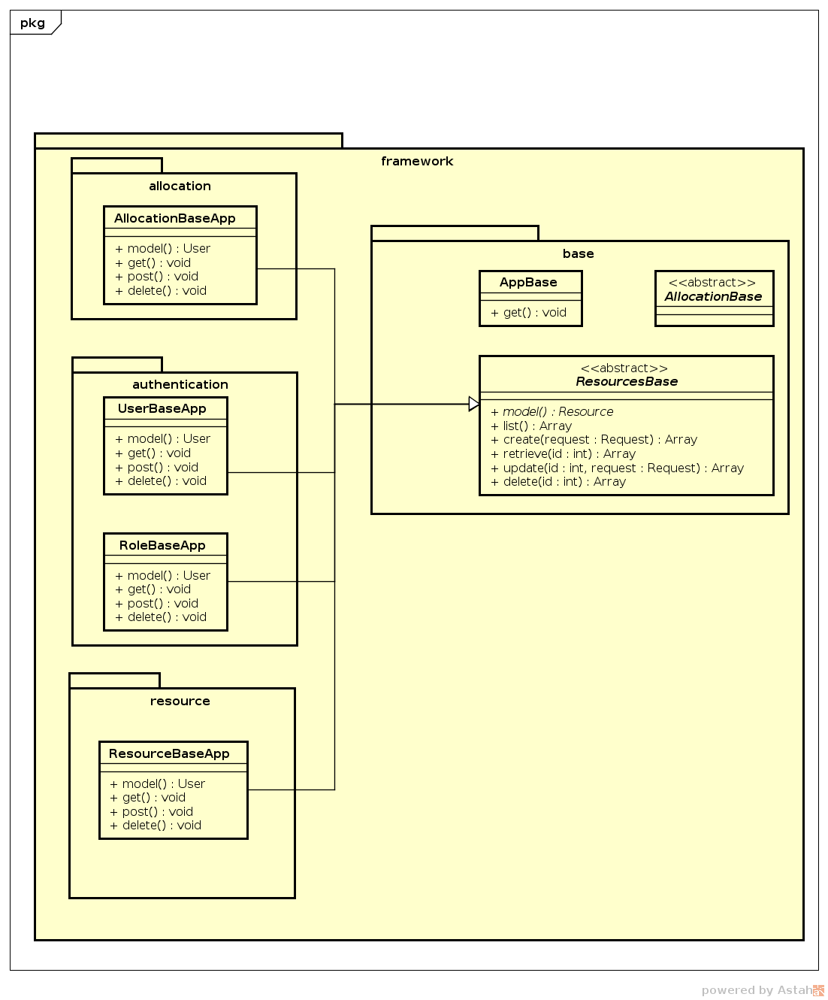

# Resource Framework

Para utilizar este framework, é necessário utilizar o ruby >= 2.4 e o sinatra 1.5.3.

## Instalando para desenvolvimento

Basta clonar este repositório utilizando o comando:

    git clone https://github.com/dasgrupo2/resourceFramework

## Instalação de dependências

### Instalar ruby

Instale o gerênciador de versões do ruby, para poder utilizar o ruby 2.4.0. Adicione a chave para ter acesso ao instalador e em seguida baixe e instale

    gpg --keyserver hkp://keys.gnupg.net --recv-keys 409B6B1796C275462A1703113804BB82D39DC0E3 7D2BAF1CF37B13E2069D6956105BD0E739499BDB
    \curl -sSL https://get.rvm.io | bash

Em seguida, instale e use o ruby 2.4

    rvm install 2.4.0
    rvm use 2.4.0 --default

### Instalar gerênciador de dependências

No ruby, por padrão, vem instalado o gerenciador de dependências `gem`, a partir dele é possível instalar o gerênciador de pacotes de projetos `bundler`, para isto basta digitar o comando a seguir.

    cd PATH_TO_PROJECT/
    bundle install

## Executando o projeto

Para executar o projeto, utiliza-se a aplicação rackup, que configura tudo para que seja criado um servidor web http. O comando a seguir tratará da migração do banco de dados, e início dos serviços necessários.

    rackup app.ru

### Desenvolvimento

Para desenvolvimento, foi configurada uma aplicação chamada `rerun` que monitorará todos os arquivos e automaticamente reiniciará os serviços ao salvá-los.

    rerun 'rackup app.ru'

## Quickstart

Para realizar o uso deste framework, basta configurar qual banco de dados será utilizado no projeto no arquivo `data_mapper.rb` de acordo com a `gem data_mapper` e seus adaptadores.

Caso seja desejado extender o framework, adicionando mais models, deve-se adicionar os pacotes ao arquivo data_mapper.

    ## data_mapper.rb
    DataMapper::setup(:default, "sqlite3::memory:")

    require_all File.expand_path "#{__dir__}/lib"
    require_all 'path_to_your_own_models'

    ...

Para adicionar constrollers customizadas, ou que implementem novas rotas ao sistema, deve-se adiciona-las ao arquivo `app.ru`.

    ## app.ru
    # Adicionando meus modelos
    use MyModelApp
    use RoleBaseApp
    use AllocationBaseApp
    use AdministratorApp
    use CommonApp
    use PlaceApp
    use ItemApp
    run BaseApp

### Rotas

As rotas padrão para o sistema são apresentadas na tabela abaixo

|Protocolo|Rota|Recurso|
|---------|----|-------|
|GET|/api/resources/:id| Dados de um item |
|GET|/api/resources/| Lista de itens a serem reservados |
|GET|/api/resources/:id/roles| Lista com id e nome das roles de um recurso |
|POST|/api/resources/:id/roles | Adiciona os roles a um resource |
|POST|/api/resources/:id| Edita os dados de um item |
|POST|/api/resources/| Adiciona um novo item |
|DELETE|/api/resources/:id| Deleta um recurso |
|---|---|---|
|GET|/api/users/:id| Dados de um usuário |
|GET|/api/users/| Lista de usuários |
|POST|/api/users/:id| Edita os dados de um usuário |
|POST|/api/users/| Adiciona um novo usuário |
|DELETE|/api/users/:id| Deleta um usuário |
|---|---|---|
|GET|/api/roles/:id| Dados de um cargo |
|GET|/api/roles/| Lista de cargos |
|POST|/api/roles/:id| Edita os dados de um cargo |
|POST|/api/roles/| Adiciona um novo cargo |
|DELETE|/api/roles/:id| Deleta um cargo |
|---|---|---|
|GET|/api/allocations/:id| Dados de uma alocação |
|GET|/api/allocations/| Lista de alocações |
|GET|/api/allocations/user/:id| Listas de alocações de um usuário |
|GET|/api/allocations/resource/:id| Listas de alocações de um recurso |
|POST|/api/allocations/| Adiciona uma nova alocação |
|DELETE|/api/allocations/:id| Deleta uma alocação |

### Atributos

Os atributos básicos das modelos são:

* Usuário: Nome, Matricula;
* Recursos: Nome, Número de registro;
* Cargo: Nome, Descrição;
* Reserva: Identificador de usuário e recurso, Hora início, Hora fim

### Personalizando

#### Model

É possível modificar os usuários e recursos e seus atributos, para isto é necessário extender as classes modelos `UserModel`, `ResourceModel` e adicionar os atributos desejados. Deve-se seguir os padrões de atributos, validações e relacionamento iguais ao DataMapper.

    require_relative '../lib/UserModel'
    class MyUser < UserModel

      property :cpf, String
      property :email, String
      property :birthday, Date

    end

#### Controller

É possível também, modificar, adicionar mais rotas para os usuários, recursos e reserva de recursos.

    require_relative '../lib/UserBaseApp'
    class MyUserApp
      @@user = MyUser

      # Add new route to get users in alphabetic order
      get '/api/users/:id/alphabetic' do
        @@user.all.sort_by {|k| k.product_number}
      end
    end

É necessário sobreescrever a variável que armazena qual model estará sendo utilizada pela controladora `@@user`. Assim, todos os demais métodos da API REST serão utilizado adequadamente.
Caso não seja fornecida uma classe derivada da esperada (ex. ModelUser para uma UserApp) será lançada uma exceção.

### Personalizando

Segue abaixo o diagrama referente as models do framework.

Segue abaixo o diagrama referente as controllers do framework.

